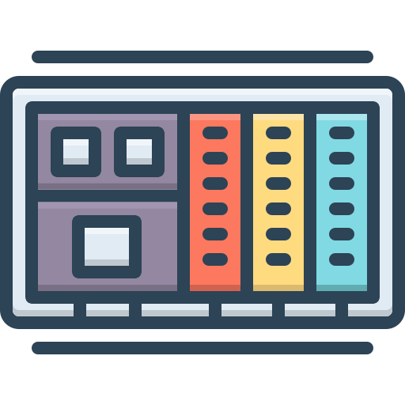

<div align="center">
  

  # CZ Virtual PLC

  **設備控制平台**

  將獨立 Plant Simulator 的製程數值轉成可掃描、可聯鎖、可追蹤的 PLC tag，
  再以版本化契約交付 CZ DCS。

  [線上系統](https://plc.tommy-huang.dev) ·
  [Plant Simulator](https://github.com/Tommy840602/czochralski-simulator) ·
  [部署說明](deploy/DEPLOY.md)
</div>

<p align="center">
  
  
  
  
  
  
  <a href="https://github.com/Tommy840602/czochralski-virtual-plc/actions/workflows/ci-cd.yml"></a>
</p>

> [!WARNING]
> 本專案是軟體模擬與工程研究用途，不是經認證的安全 PLC、SIS 或實體設備控制器。
> 未完成獨立安全設計、FAT/SAT 與現場驗證前，請勿直接連接真實致動器。

## 在整體系統中的位置

```text
Plant Simulator
  製程物理與感測值
        │ OPC UA
        ▼
CZ Virtual PLC
  Input Image → Interlock → Sequence → Local Control → Output Image
        │ cz.plc.dcs.telemetry.v2
        ▼
CZ DCS
  分散控制、操作與監督
        │ cz.dcs.spc.telemetry.v3
        ▼
CZ SPC
  品質監控、X̄-R 與簽核治理
```

| 平台 | 職責 | 線上入口 |
|---|---|---|
| **CZ Virtual PLC** | tag、掃描週期、聯鎖、順序控制與本地控制 | [plc.tommy-huang.dev](https://plc.tommy-huang.dev) |
| [CZ DCS](https://github.com/Tommy840602/czochralski-web-based-dcs) | 分散 PID、操作站、告警與工程治理 | [dcs.tommy-huang.dev](https://dcs.tommy-huang.dev) |
| [CZ SPC](https://github.com/Tommy840602/czochralski-spc) | 統計製程管制、能力分析與品質工作流 | [spc.tommy-huang.dev](https://spc.tommy-huang.dev) |

## 核心能力

- **固定週期掃描**：依序更新輸入映像、品質碼、聯鎖、製程階段、控制輸出與 telemetry。
- **OPC UA 製程介面**：讀取獨立 Plant Simulator，維持明確的 Plant／PLC 系統邊界。
- **安全聯鎖**：來源逾時、品質不良或停止狀態時，輸出進入 fail-safe。
- **順序控制**：支援 `MELT → STABILIZE → SEED → NECK → CROWN → BODY → TAIL` 製程階段。
- **本地控制**：在 PLC 內執行溫度與直徑控制，DCS 負責監督與上層命令。
- **週期追蹤**：以真正的 `cycleId`、`ingotId`、狀態與正常／中止結果描述每次長晶。
- **版本化交付**：以 `cz.plc.dcs.telemetry.v2` 提供 DCS 穩定、可演進的資料契約。
- **研究工具**：保留晶棒探索、前兆分析、輪廓監控、控制調參與品質分析頁面。

## 執行模型

每次掃描遵循相同順序，避免 UI、DCS 與歷史資料看見彼此矛盾的狀態：

```text
1. Read Plant tags
2. Validate OPC UA quality and freshness
3. Update PLC input image
4. Evaluate safety interlocks
5. Advance process sequence
6. Calculate local control
7. Write Plant output image
8. Publish immutable DCS snapshot
```

### 資料權威

| 資料 | 權威來源 | 說明 |
|---|---|---|
| 製程 PV | Plant Simulator | PLC 不自行捏造實體量測值 |
| 聯鎖與 phase | CZ Virtual PLC | 由 scan、quality 與 sequence 決定 |
| 控制輸出 | CZ Virtual PLC | 停止或失聯時歸零／進安全值 |
| PID 監督與操作 | CZ DCS | 不取代 PLC 的安全聯鎖 |
| SPC 判異 | CZ SPC | 不回寫 PLC 或 DCS |

## 身份與簽核

帳號、申請狀態與稽核事件均存於 PostgreSQL，不使用 SQLite。

- `Operator`：操作 runtime、啟停模擬流程。
- `Engineer`：調整工程參數、執行分析與提出變更。
- `Lead`：審核帳號與受管制的工程變更。
- 新帳號先進入 `PENDING`，核准後才可登入。
- 後端執行 RBAC；前端顯示的角色不是授權依據。

## 技術架構

```text
Vue 3 + ECharts
       │ same-origin /api
       ▼
FastAPI
  ├─ Auth / RBAC / registration approval
  ├─ PLC runtime / scan / sequence / interlock
  ├─ OPC UA Plant adapter
  ├─ DCS snapshot contract
  └─ Analytics API
       │
       ├─ PostgreSQL 17  identity / approval / audit
       └─ Parquet / fsspec / GCS  research datasets
```

| 層級 | 技術 |
|---|---|
| 前端 | Vue 3、Vite 6、Pinia、Vue Router、ECharts 6 |
| API | Python 3.11、FastAPI、Pydantic、Uvicorn |
| 工業介面 | OPC UA／`asyncua`、版本化 JSON snapshot |
| 資料分析 | pandas、NumPy、SciPy、PyArrow、fsspec／gcsfs |
| 平台狀態 | PostgreSQL 17、psycopg |
| 部署 | Docker Compose、nginx、GitHub Actions |

## 快速開始

### 本機開發

需求：Python 3.11+、Node.js 20+、npm。

```bash
git clone https://github.com/Tommy840602/czochralski-virtual-plc.git
cd czochralski-virtual-plc

python -m venv backend/.venv
backend/.venv/bin/pip install -r backend/requirements.txt

cd frontend
npm ci
cd ..

./run.sh
```

啟動後：

- 前端：`http://localhost:5173`
- API：`http://localhost:8000`
- API 文件：`http://localhost:8000/docs`

複製 `.env.example` 為 `.env` 後，可切換 PostgreSQL、資料根、掃描週期及 Plant Simulator
連線。要啟用真實 runtime，請同時啟動獨立的
[Czochralski Plant Simulator](https://github.com/Tommy840602/czochralski-simulator)。

### Docker Compose

```bash
docker compose up -d --build
```

預設入口為 `http://localhost:8080`，PostgreSQL 僅綁定本機 `5434`。

## 測試

```bash
cd backend
pip install -r requirements-dev.txt
PYTHONPATH=. pytest -q

cd ../frontend
npm ci
npm run build
```

測試涵蓋 PLC scan、Plant adapter、DCS 契約與 health endpoint 的安全邊界。

正式環境 smoke、10-VU baseline 與 breakpoint 結果見
[load-tests/README.md](load-tests/README.md)。

## 部署

`.github/workflows/ci-cd.yml` 在 Pull Request 與 `main` push 時驗證後端、前端及部署設定；
只有通過驗證的 `main` 才部署到 Hetzner。

- 正式網域：`https://plc.tommy-huang.dev`
- 應用目錄：`/opt/apps/plc.tommy-huang.dev`
- Compose project 與網路採專案隔離，不會停止同主機的 DCS／SPC。
- secrets 由 GitHub `production` Environment 與主機 `.env` 管理，不寫入 repository。

完整主機準備、反向代理與回滾流程見 [deploy/DEPLOY.md](deploy/DEPLOY.md)。

## 專案結構

```text
.
├── backend/          FastAPI、PLC runtime、OPC UA、身份與測試
├── frontend/         Vue 操作介面與分析頁
├── analysis/         離線研究 pipeline
├── docs/             控制、前兆與架構文件
├── deploy/           Hetzner、nginx／Caddy 與環境範本
├── scripts/          部署及維運腳本
├── docker-compose*.yml
└── run.sh
```

## 延伸文件

- [Control analysis](docs/control_analysis.md)
- [Early-warning analysis](docs/earlywarning_analysis.md)
- [Excitation experiment](docs/excitation_experiment.md)
- [Body-break confounding audit](docs/body_break_confound_audit.md)
- [GCS deployment](docs/gcs_deployment.md)

---

<div align="center">
  <strong>Plant Simulator → CZ Virtual PLC → CZ DCS → CZ SPC</strong><br>
  一條可追蹤、可驗證、職責分離的 Czochralski 模擬資料鏈。
</div>
